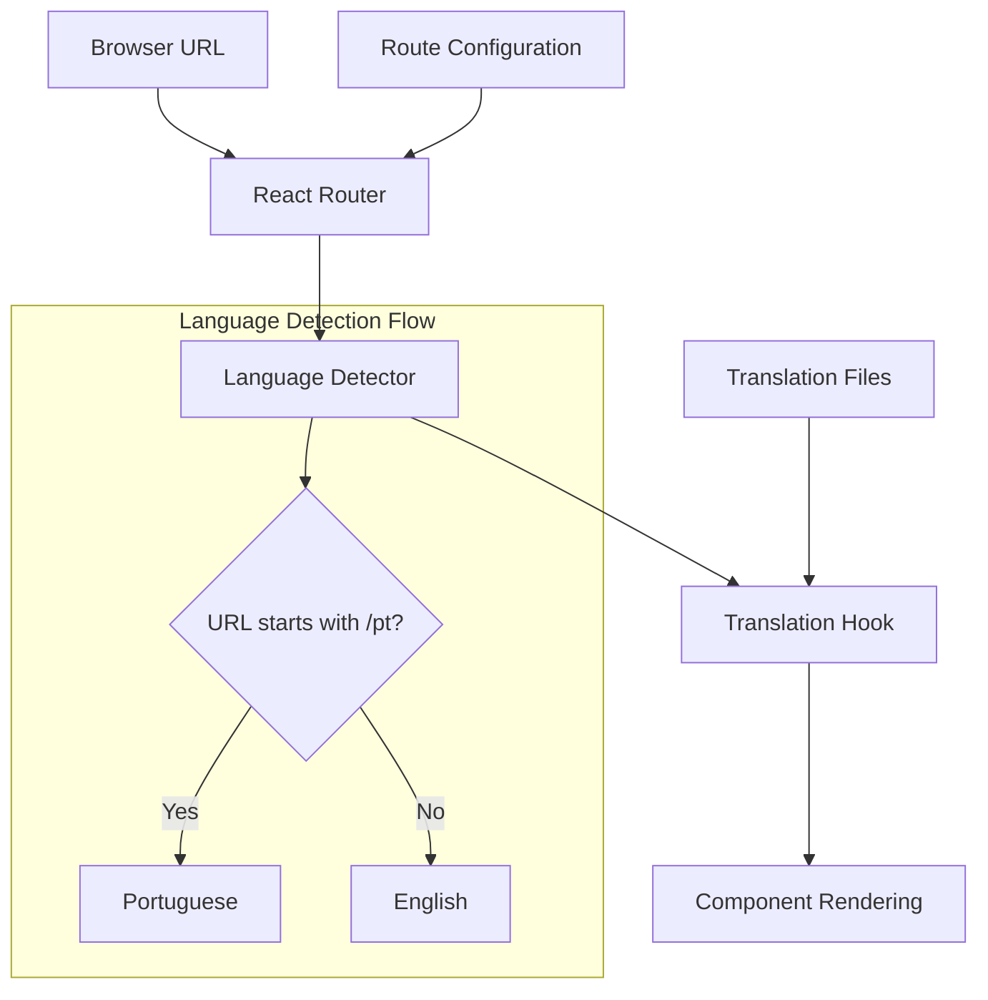

# Design Document

## Overview

The route-based internationalization system transforms the current profile-based language detection into a URL-driven approach. The system will support English as the default language (served at root paths) and Portuguese with a `/pt` prefix, providing clean, SEO-friendly URLs while maintaining all existing functionality.

## Architecture

### High-Level Architecture



### Route Structure Design

The application will implement a nested routing structure that supports optional language prefixes:

```
/ (English - Default)
├── /auth
├── /horoscope  
├── /compatibility
├── /love-sketch
├── /astral-map
├── /ai-oracle
├── /diary
├── /weekly-report
├── /tarot
└── /*

/pt (Portuguese - Prefixed)
├── /pt/auth
├── /pt/horoscope
├── /pt/compatibility
├── /pt/love-sketch
├── /pt/astral-map
├── /pt/ai-oracle
├── /pt/diary
├── /pt/weekly-report
├── /pt/tarot
└── /pt/*
```

## Components and Interfaces

### 1. Language Detection System

**Location**: `src/hooks/useTranslation.tsx`

**Current Implementation**:
```typescript
// Profile-based (current)
const language: Language = (profile?.language_preference as Language) || 'pt';
```

**New Implementation**:
```typescript
// Route-based (new)
const location = useLocation();
const language: Language = location.pathname.startsWith('/pt') ? 'pt' : 'en';
```

**Interface**:
```typescript
interface LanguageDetector {
  getCurrentLanguage(): Language;
  isPortuguese(): boolean;
  isEnglish(): boolean;
}
```

### 2. Route Configuration Component

**Location**: `src/App.tsx`

**Design Pattern**: Nested Routes with Optional Language Parameter

```typescript
interface RouteConfig {
  path: string;
  element: React.ComponentType;
  languagePrefix?: string;
}

interface LanguageRouteWrapper {
  language: Language;
  children: React.ReactNode;
}
```

### 3. Translation Hook Enhancement

**Current Interface**:
```typescript
interface TranslationHook {
  t: (key: string, values?: Record<string, string>) => string;
  language: Language;
}
```

**Enhanced Interface** (maintains compatibility):
```typescript
interface EnhancedTranslationHook extends TranslationHook {
  isRouteBasedLanguage: boolean;
  getLanguageFromPath: (pathname: string) => Language;
}
```

### 4. Translation Data Structure

**Current Structure**: Complete Portuguese translations, partial English translations

**Required Enhancement**: Complete English translation object

```typescript
interface TranslationStructure {
  pt: CompleteTranslations;
  en: CompleteTranslations; // Currently incomplete - needs all keys from pt
}
```

## Data Models

### Language Detection Model

```typescript
type Language = 'pt' | 'en';

interface LanguageContext {
  current: Language;
  available: Language[];
  detection: 'route' | 'profile' | 'browser';
}
```

### Route Language Mapping

```typescript
interface RouteLanguageMap {
  '/': 'en';
  '/pt': 'pt';
  '/auth': 'en';
  '/pt/auth': 'pt';
  // ... all other routes
}
```

### Translation Completion Model

```typescript
interface TranslationCompletionStatus {
  language: Language;
  totalKeys: number;
  completedKeys: number;
  missingKeys: string[];
  completionPercentage: number;
}
```

## Error Handling

### 1. Route Language Detection Errors

**Scenario**: Invalid language prefix or malformed URLs
**Handling**: Default to English, log warning

```typescript
const detectLanguageFromRoute = (pathname: string): Language => {
  try {
    if (pathname.startsWith('/pt')) return 'pt';
    return 'en';
  } catch (error) {
    console.warn('Language detection failed, defaulting to English:', error);
    return 'en';
  }
};
```

### 2. Translation Key Missing Errors

**Scenario**: Translation key not found in target language
**Handling**: Fallback to key name, log warning

```typescript
const getTranslationWithFallback = (language: Language, key: string): string => {
  try {
    return getTranslation(language, key);
  } catch (error) {
    console.warn(`Translation missing for ${key} in ${language}`);
    return key;
  }
};
```

### 3. Route Navigation Errors

**Scenario**: Navigation to non-existent language routes
**Handling**: Redirect to English equivalent or 404

```typescript
const handleRouteError = (pathname: string): string => {
  if (pathname.startsWith('/pt/')) {
    const englishPath = pathname.replace('/pt', '');
    return englishPath || '/';
  }
  return '/404';
};
```

## Testing Strategy

### 1. Unit Testing

**Language Detection Tests**:
- Test URL parsing for different route patterns
- Test language detection accuracy
- Test fallback behavior for invalid routes

**Translation Hook Tests**:
- Test translation key resolution
- Test placeholder replacement
- Test language switching behavior

### 2. Integration Testing

**Route Navigation Tests**:
- Test navigation between English and Portuguese routes
- Test component rendering with correct language
- Test state preservation during language changes

**Component Integration Tests**:
- Test all page components with both languages
- Test sidebar navigation with language-specific routes
- Test form submissions with correct language context

### 3. End-to-End Testing

**User Journey Tests**:
- Test complete user flows in English
- Test complete user flows in Portuguese
- Test URL sharing and direct access
- Test browser back/forward navigation

### 4. Translation Completeness Testing

**Automated Translation Validation**:
- Verify all Portuguese keys have English equivalents
- Test translation key consistency across languages
- Validate placeholder usage in both languages

## Implementation Phases

### Phase 1: Core Infrastructure
1. Update `useTranslation` hook for route-based detection
2. Implement language detection utilities
3. Create route configuration structure

### Phase 2: Translation Completion
1. Complete English translations for all missing keys
2. Validate translation key consistency
3. Test translation accuracy and context

### Phase 3: Route Implementation
1. Update `App.tsx` with nested route structure
2. Implement language-aware routing
3. Test route navigation and URL generation

### Phase 4: Component Updates
1. Update all page components to use new translation system
2. Update UI components for route-based language detection
3. Test component functionality in both languages

### Phase 5: Validation and Optimization
1. Comprehensive testing across all components
2. Performance optimization for language detection
3. Error handling and edge case coverage

## Migration Strategy

### Backward Compatibility
- Maintain existing translation key structure
- Preserve component interfaces
- Support gradual migration of components

### Data Migration
- No database changes required
- Profile language preferences become unused but preserved
- Existing user data remains intact

### Rollback Plan
- Keep original `useTranslation` implementation as backup
- Feature flag for route-based vs profile-based detection
- Quick revert capability if issues arise

## Performance Considerations

### Language Detection Optimization
- Cache language detection results per route
- Minimize re-renders during route changes
- Optimize translation key lookups

### Bundle Size Management
- Consider code splitting for language-specific content
- Lazy load translation objects if needed
- Optimize translation file structure

### SEO Optimization
- Ensure proper meta tags for each language
- Implement hreflang attributes for language variants
- Optimize URL structure for search engines